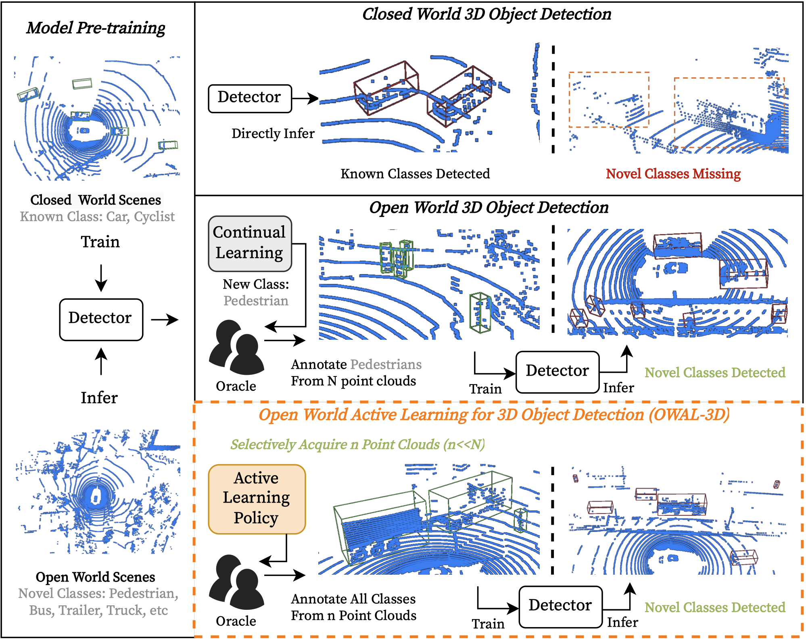
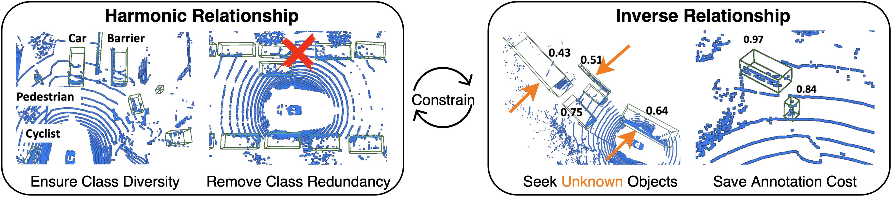

<p align="center">
  
</p>

-----------------------


This branch is the official Pytorch implementation of our work **Open-CRB: Towards Open World Active Learning for 3D Object Detection**.

[[Open-CRB Branch]](https://github.com/Luoyadan/CRB-active-3Ddet/tree/Open-CRB) [[arXiv]](https://arxiv.org/abs/2310.10391) 

:fire: 11/23 updates: release the code and the preprint of **Open-CRB**

## Framework
Significant strides have been made in closed-world 3D object detection, testing systems in environments with known classes. However, the challenge arises in open world scenarios where new object classes appear. Existing efforts sequentially learn novel classes from streams of labeled data at a significant annotation cost, impeding efficient deployment to the wild. To seek effective solutions, we investigate a more practical yet challenging research task: Open World Active Learning for 3D Object Detection (OWAL-3D), aiming at selecting a small number of 3D boxes to annotate while maximizing detection performance on both known and unknown classes. The core difficulty centers on striking a balance between mining more unknown instances and minimizing the labeling expenses of point clouds. Empirically, our study finds the harmonious and inverse relationship between box quantities and their confidences can help alleviate the dilemma, avoiding the repeated selection of common known instances and focusing on uncertain objects that are potentially unknown. We unify both relational constraints into a simple and effective AL strategy namely Open-CRB, which guides to acquisition of informative point clouds with the least amount of boxes to label. Furthermore, we develop a comprehensive codebase for easy reproducing and future research, supporting 15 baseline methods (\textit{i.e.}, active learning, out-of-distribution detection and open world detection), 2 types of modern 3D detectors (\textit{i.e.}, one-stage SECOND and two-stage PV-RCNN) and 3 benchmark 3D datasets (\textit{i.e.}, KITTI, nuScenes and Waymo). Extensive experiments evidence that the proposed Open-CRB demonstrates superiority and flexibility in recognizing both novel and shared categories with very limited labeling costs, compared to state-of-the-art baselines. 

<p align="center">

</p>


----
## Contents
* [Installation](#Installation)
  * [Requirements](#Requirements)
  * [pcdet v0.5](#install-pcdet-v05)
* [Getting Started](#getting-started)
  * [Requirements](#Requirements)
  * [KITTI Dataset](#KITTI-Dataset)
  * [Waymo Open Dataset](#Waymo-Open-Dataset)
  <!-- * [Lyft Dataset](#Lyft-Dataset) -->
  * [Training & Testing](#training--testing)


# Installation

### Requirements
All the codes are tested in the following environment:
* Python 3.8+
* PyTorch 1.10.1
* CUDA 11.3 
* wandb
* [`spconv-cu113 v2.1.21`](https://github.com/traveller59/spconv)


### Install `pcdet v0.5`
Our implementations of 3D detectors are based on the lastest [`OpenPCDet`](https://github.com/open-mmlab/OpenPCDet). To install this `pcdet` library and its dependent libraries, please run the following command:

```shell
python setup.py develop
```
> NOTE: Please re-install even if you have already installed pcdet previoursly.


# Getting Started
The **active learning configs** are located at [tools/cfgs/active-kitti_models](./tools/cfgs/active-kitti_models) and [/tools/cfgs/active-waymo_models](./tools/cfgs/active-waymo_models) for different AL methods. The dataset configs are located within [tools/cfgs/dataset_configs](./tools/cfgs/dataset_configs), 
and the model configs are located within [tools/cfgs](./tools/cfgs) for different datasets. 


## Dataset Preparation
Currently we provide the dataloader of KITTI dataset and Waymo dataset, and the supporting of more datasets are on the way.  

### KITTI Dataset
* Please download the official [KITTI 3D object detection](http://www.cvlibs.net/datasets/kitti/eval_object.php?obj_benchmark=3d) dataset and organize the downloaded files as follows (the road planes could be downloaded from [[road plane]](https://drive.google.com/file/d/1d5mq0RXRnvHPVeKx6Q612z0YRO1t2wAp/view?usp=sharing), which are optional for data augmentation in the training):
* If you would like to train [CaDDN](../tools/cfgs/kitti_models/CaDDN.yaml), download the precomputed [depth maps](https://drive.google.com/file/d/1qFZux7KC_gJ0UHEg-qGJKqteE9Ivojin/view?usp=sharing) for the KITTI training set
* NOTE: if you already have the data infos from `pcdet v0.1`, you can choose to use the old infos and set the DATABASE_WITH_FAKELIDAR option in tools/cfgs/dataset_configs/kitti_dataset.yaml as True. The second choice is that you can create the infos and gt database again and leave the config unchanged.

```
CRB-active-3Ddet
├── data
│   ├── kitti
│   │   │── ImageSets
│   │   │── training
│   │   │   ├──calib & velodyne & label_2 & image_2 & (optional: planes) & (optional: depth_2)
│   │   │── testing
│   │   │   ├──calib & velodyne & image_2
├── pcdet
├── tools
```

* Generate the data infos by running the following command: 
```python 
python -m pcdet.datasets.kitti.kitti_dataset create_kitti_infos tools/cfgs/dataset_configs/kitti_dataset.yaml
```

<!-- ### NuScenes Dataset
* Please download the official [NuScenes 3D object detection dataset](https://www.nuscenes.org/download) and 
organize the downloaded files as follows: 
```
CRB-active-3Ddet
├── data
│   ├── nuscenes
│   │   │── v1.0-trainval (or v1.0-mini if you use mini)
│   │   │   │── samples
│   │   │   │── sweeps
│   │   │   │── maps
│   │   │   │── v1.0-trainval  
├── pcdet
├── tools
```

* Install the `nuscenes-devkit` with version `1.0.5` by running the following command: 
```shell script
pip install nuscenes-devkit==1.0.5
```

* Generate the data infos by running the following command (it may take several hours): 
```python 
python -m pcdet.datasets.nuscenes.nuscenes_dataset --func create_nuscenes_infos \
    --cfg_file tools/cfgs/dataset_configs/nuscenes_dataset.yaml \
    --version v1.0-trainval
``` -->

### Waymo Open Dataset
* Please download the official [Waymo Open Dataset](https://waymo.com/open/download/), 
including the training data `training_0000.tar~training_0031.tar` and the validation 
data `validation_0000.tar~validation_0007.tar`.
* Unzip all the above `xxxx.tar` files to the directory of `data/waymo/raw_data` as follows (You could get 798 *train* tfrecord and 202 *val* tfrecord ):  
```
CRB-active-3Ddet
├── data
│   ├── waymo
│   │   │── ImageSets
│   │   │── raw_data
│   │   │   │── segment-xxxxxxxx.tfrecord
|   |   |   |── ...
|   |   |── waymo_processed_data_v0_5_0
│   │   │   │── segment-xxxxxxxx/
|   |   |   |── ...
│   │   │── waymo_processed_data_v0_5_0_gt_database_train_sampled_1/
│   │   │── waymo_processed_data_v0_5_0_waymo_dbinfos_train_sampled_1.pkl
│   │   │── waymo_processed_data_v0_5_0_gt_database_train_sampled_1_global.npy (optional)
│   │   │── waymo_processed_data_v0_5_0_infos_train.pkl (optional)
│   │   │── waymo_processed_data_v0_5_0_infos_val.pkl (optional)
├── pcdet
├── tools
```
* Install the official `waymo-open-dataset` by running the following command: 
```shell script
pip3 install --upgrade pip
pip3 install waymo-open-dataset-tf-2-0-0==1.2.0 --user
```
> Waymo version in our project is 1.2.0

* Extract point cloud data from tfrecord and generate data infos by running the following command (it takes several hours, 
and you could refer to `data/waymo/waymo_processed_data_v0_5_0` to see how many records that have been processed): 
```python 
python -m pcdet.datasets.waymo.waymo_dataset --func create_waymo_infos \
    --cfg_file tools/cfgs/dataset_configs/waymo_dataset.yaml
```

Note that you do not need to install `waymo-open-dataset` if you have already processed the data before and do not need to evaluate with official Waymo Metrics. 

<!-- 
### Lyft Dataset
* Please download the official [Lyft Level5 perception dataset](https://level-5.global/data/perception) and 
organize the downloaded files as follows: 
```
CRB-active-3Ddet
├── data
│   ├── lyft
│   │   │── ImageSets
│   │   │── trainval
│   │   │   │── data & maps & images & lidar & train_lidar
├── pcdet
├── tools
```

* Install the `lyft-dataset-sdk` with version `0.0.8` by running the following command: 
```shell script
pip install -U lyft_dataset_sdk==0.0.8
```

* Generate the data infos by running the following command (it may take several hours): 
```python 
python -m pcdet.datasets.lyft.lyft_dataset --func create_lyft_infos \
    --cfg_file tools/cfgs/dataset_configs/lyft_dataset.yaml
```

* You need to check carefully since we don't provide a benchmark for it. -->


## Training & Testing


### Test and evaluate the pretrained models
The weights of our pre-trained model will be released upon acceptance.

* Test with a pretrained model: 
```shell script
python test.py --cfg_file ${CONFIG_FILE} --batch_size ${BATCH_SIZE} --ckpt ${CKPT}
```

* To test all the saved checkpoints of a specific training setting and draw the performance curve on the Tensorboard, add the `--eval_all` argument: 
```shell script
python test.py --cfg_file ${CONFIG_FILE} --batch_size ${BATCH_SIZE} --eval_all
```

* To test with multiple GPUs:
```shell script
sh scripts/dist_test.sh ${NUM_GPUS} \
    --cfg_file ${CONFIG_FILE} --batch_size ${BATCH_SIZE}

# or

sh scripts/slurm_test_mgpu.sh ${PARTITION} ${NUM_GPUS} \
    --cfg_file ${CONFIG_FILE} --batch_size ${BATCH_SIZE}
```

### Train a backbone
In our active learning setting, the 3D detector will be pre-trained with a small labeled set $\mathcal{D}_L$ which is randomly sampled from the trainig set. To train such a backbone, please run

```shell script
sh scripts/pretrain_for_open-crb.sh
```


### Train with different active learning strategies
We provide several options for active learning algorithms, including
- random selection [`random`]
- entropy sampling [`entropy`]
- MC-Reg sampling [`mc`]
- greedy coreset [`coreset`]
- ReAct sampling [`react`]
- GradNorm sampling [`gradnorm`]
- Cider sampling [`cider`]
- Open-CRN sampling [`open-crb`]

For PROB, you need an seperately pretrained model with additional heads, refer to `cfgs/owal-3d_nuscenes_models_prob/*`.

You could optionally add extra command line parameters `--batch_size ${BATCH_SIZE}` and `--epochs ${EPOCHS}` to specify your preferred parameters. 

* Train:
```shell script
sh scripts/train_and_test_open-crb.sh
```
