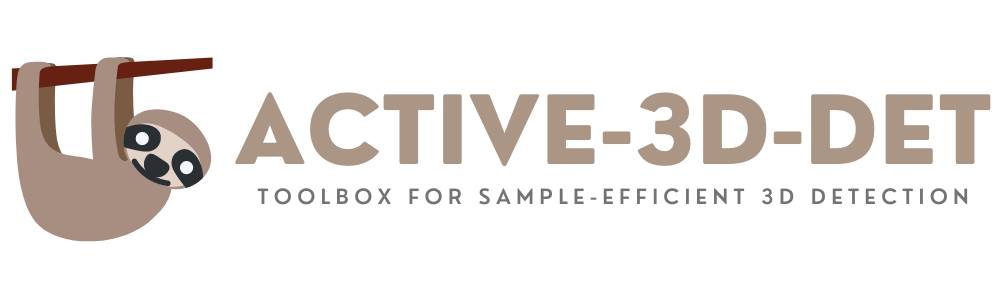
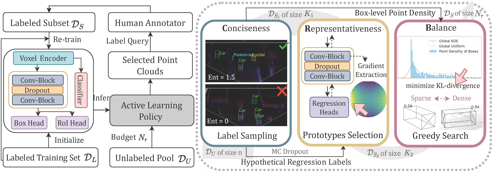

<p align="center">
  
</p>

-----------------------


This work is the official Pytorch implementation of our NeurIPS submission: **CRB: Three Gold Criteria for Active 3D Detection**.

## Framework
To alleviate the high annotation cost in LiDAR-based 3D object detection, active learning is a promising solution that learns to select only a small portion of unlabeled data to annotate, without compromising model performance. However, mainstream uncertainty-based and diversity-based active learning policies are not effective when applied in the 3D detection task, as they fail to balance the trade-off between point cloud informativeness and box-level annotation costs. To overcome this limitation, we investigate three gold criteria for point cloud acquisition, namely CRB: Conciseness, Representativeness, and Balance. The proposed criteria ensure that acquired point clouds share (1) non-redundant semantics, (2) influential prototypes of novel knowledge, and (3) similar geometric characteristics with the unlabeled pool. Our theoretical analysis demonstrates that the proposed criteria mitigate the gap between the marginal distribution of the selected subset and the prior distribution of the test set, and minimizes the upper bound of the generalization error. Extensive experiments on the benchmark 3D object detection datasets of KITTI and Waymo evidence that the proposed approach outperforms existing active learning strategies and achieves fully supervised performance requiring $1\%$ and $8\%$ annotations of bounding boxes and point clouds, respectively.

<p align="center">

</p>

----
## Contents
* [Requirements]
* [Installation](#Installation)
  * [Requirements]
* [Installa]
* [Dataset Preparation](#dataset-preparation)
  * [Data structure](#data-structure)
  * [File lists for training/validation](#file-lists-for-trainingvalidation)
  * [Input data](#input-data)
* [Usage](#usage)
  * [Training](#training)
  * [Testing](#testing)
<!--   * [Video Demo](#video-demo) -->
* [Options](#options)
  * [More options](#more-options)
<!-- * [Citation](#citation)
* [Contact](#contact) -->

# Installation

### Requirements
All the codes are tested in the following environment:
* Linux (tested on Ubuntu 14.04/16.04/18.04/20.04/21.04)
* Python 3.6+
* PyTorch 1.1 or higher (tested on PyTorch 1.1, 1,3, 1,5~1.10)
* CUDA 9.0 or higher (PyTorch 1.3+ needs CUDA 9.2+)
* [`spconv v1.0 (commit 8da6f96)`](https://github.com/traveller59/spconv/tree/8da6f967fb9a054d8870c3515b1b44eca2103634) or [`spconv v1.2`](https://github.com/traveller59/spconv) or [`spconv v2.x`](https://github.com/traveller59/spconv)


### Install `pcdet v0.5`
NOTE: Please re-install `pcdet v0.5` by running `python setup.py develop` even if you have already installed previous version.

a. Clone this repository.
```shell
git clone https://github.com/open-mmlab/OpenPCDet.git
```

b. Install the dependent libraries as follows:

[comment]: <> (* Install the dependent python libraries: )

[comment]: <> (```)

[comment]: <> (pip install -r requirements.txt )

[comment]: <> (```)

* Install the SparseConv library, we use the implementation from [`[spconv]`](https://github.com/traveller59/spconv). 
    * If you use PyTorch 1.1, then make sure you install the `spconv v1.0` with ([commit 8da6f96](https://github.com/traveller59/spconv/tree/8da6f967fb9a054d8870c3515b1b44eca2103634)) instead of the latest one.
    * If you use PyTorch 1.3+, then you need to install the `spconv v1.2`. As mentioned by the author of [`spconv`](https://github.com/traveller59/spconv), you need to use their docker if you use PyTorch 1.4+. 
    * You could also install latest `spconv v2.x` with pip, see the official documents of [spconv](https://github.com/traveller59/spconv).
  
c. Install this `pcdet` library and its dependent libraries by running the following command:
```shell
python setup.py develop
```


# Getting Started
The dataset configs are located within [tools/cfgs/dataset_configs](../tools/cfgs/dataset_configs), 
and the model configs are located within [tools/cfgs](../tools/cfgs) for different datasets. 


## Dataset Preparation

Currently we provide the dataloader of KITTI dataset and NuScenes dataset, and the supporting of more datasets are on the way.  

### KITTI Dataset
* Please download the official [KITTI 3D object detection](http://www.cvlibs.net/datasets/kitti/eval_object.php?obj_benchmark=3d) dataset and organize the downloaded files as follows (the road planes could be downloaded from [[road plane]](https://drive.google.com/file/d/1d5mq0RXRnvHPVeKx6Q612z0YRO1t2wAp/view?usp=sharing), which are optional for data augmentation in the training):
* If you would like to train [CaDDN](../tools/cfgs/kitti_models/CaDDN.yaml), download the precomputed [depth maps](https://drive.google.com/file/d/1qFZux7KC_gJ0UHEg-qGJKqteE9Ivojin/view?usp=sharing) for the KITTI training set
* NOTE: if you already have the data infos from `pcdet v0.1`, you can choose to use the old infos and set the DATABASE_WITH_FAKELIDAR option in tools/cfgs/dataset_configs/kitti_dataset.yaml as True. The second choice is that you can create the infos and gt database again and leave the config unchanged.

```
OpenPCDet
├── data
│   ├── kitti
│   │   │── ImageSets
│   │   │── training
│   │   │   ├──calib & velodyne & label_2 & image_2 & (optional: planes) & (optional: depth_2)
│   │   │── testing
│   │   │   ├──calib & velodyne & image_2
├── pcdet
├── tools
```

* Generate the data infos by running the following command: 
```python 
python -m pcdet.datasets.kitti.kitti_dataset create_kitti_infos tools/cfgs/dataset_configs/kitti_dataset.yaml
```

### NuScenes Dataset
* Please download the official [NuScenes 3D object detection dataset](https://www.nuscenes.org/download) and 
organize the downloaded files as follows: 
```
OpenPCDet
├── data
│   ├── nuscenes
│   │   │── v1.0-trainval (or v1.0-mini if you use mini)
│   │   │   │── samples
│   │   │   │── sweeps
│   │   │   │── maps
│   │   │   │── v1.0-trainval  
├── pcdet
├── tools
```

* Install the `nuscenes-devkit` with version `1.0.5` by running the following command: 
```shell script
pip install nuscenes-devkit==1.0.5
```

* Generate the data infos by running the following command (it may take several hours): 
```python 
python -m pcdet.datasets.nuscenes.nuscenes_dataset --func create_nuscenes_infos \
    --cfg_file tools/cfgs/dataset_configs/nuscenes_dataset.yaml \
    --version v1.0-trainval
```

### Waymo Open Dataset
* Please download the official [Waymo Open Dataset](https://waymo.com/open/download/), 
including the training data `training_0000.tar~training_0031.tar` and the validation 
data `validation_0000.tar~validation_0007.tar`.
* Unzip all the above `xxxx.tar` files to the directory of `data/waymo/raw_data` as follows (You could get 798 *train* tfrecord and 202 *val* tfrecord ):  
```
OpenPCDet
├── data
│   ├── waymo
│   │   │── ImageSets
│   │   │── raw_data
│   │   │   │── segment-xxxxxxxx.tfrecord
|   |   |   |── ...
|   |   |── waymo_processed_data_v0_5_0
│   │   │   │── segment-xxxxxxxx/
|   |   |   |── ...
│   │   │── waymo_processed_data_v0_5_0_gt_database_train_sampled_1/
│   │   │── waymo_processed_data_v0_5_0_waymo_dbinfos_train_sampled_1.pkl
│   │   │── waymo_processed_data_v0_5_0_gt_database_train_sampled_1_global.npy (optional)
│   │   │── waymo_processed_data_v0_5_0_infos_train.pkl (optional)
│   │   │── waymo_processed_data_v0_5_0_infos_val.pkl (optional)
├── pcdet
├── tools
```
* Install the official `waymo-open-dataset` by running the following command: 
```shell script
pip3 install --upgrade pip
# tf 2.0.0
pip3 install waymo-open-dataset-tf-2-5-0 --user
```

* Extract point cloud data from tfrecord and generate data infos by running the following command (it takes several hours, 
and you could refer to `data/waymo/waymo_processed_data_v0_5_0` to see how many records that have been processed): 
```python 
python -m pcdet.datasets.waymo.waymo_dataset --func create_waymo_infos \
    --cfg_file tools/cfgs/dataset_configs/waymo_dataset.yaml
```

Note that you do not need to install `waymo-open-dataset` if you have already processed the data before and do not need to evaluate with official Waymo Metrics. 


### Lyft Dataset
* Please download the official [Lyft Level5 perception dataset](https://level-5.global/data/perception) and 
organize the downloaded files as follows: 
```
OpenPCDet
├── data
│   ├── lyft
│   │   │── ImageSets
│   │   │── trainval
│   │   │   │── data & maps & images & lidar & train_lidar
├── pcdet
├── tools
```

* Install the `lyft-dataset-sdk` with version `0.0.8` by running the following command: 
```shell script
pip install -U lyft_dataset_sdk==0.0.8
```

* Generate the data infos by running the following command (it may take several hours): 
```python 
python -m pcdet.datasets.lyft.lyft_dataset --func create_lyft_infos \
    --cfg_file tools/cfgs/dataset_configs/lyft_dataset.yaml
```

* You need to check carefully since we don't provide a benchmark for it.


## Pretrained Models
If you would like to train [CaDDN](../tools/cfgs/kitti_models/CaDDN.yaml), download the pretrained [DeepLabV3 model](https://download.pytorch.org/models/deeplabv3_resnet101_coco-586e9e4e.pth) and place within the `checkpoints` directory. Please make sure the [kornia](https://github.com/kornia/kornia) is installed since it is needed for `CaDDN`.
```
OpenPCDet
├── checkpoints
│   ├── deeplabv3_resnet101_coco-586e9e4e.pth
├── data
├── pcdet
├── tools
```

## Training & Testing


### Test and evaluate the pretrained models
* Test with a pretrained model: 
```shell script
python test.py --cfg_file ${CONFIG_FILE} --batch_size ${BATCH_SIZE} --ckpt ${CKPT}
```

* To test all the saved checkpoints of a specific training setting and draw the performance curve on the Tensorboard, add the `--eval_all` argument: 
```shell script
python test.py --cfg_file ${CONFIG_FILE} --batch_size ${BATCH_SIZE} --eval_all
```

* To test with multiple GPUs:
```shell script
sh scripts/dist_test.sh ${NUM_GPUS} \
    --cfg_file ${CONFIG_FILE} --batch_size ${BATCH_SIZE}

# or

sh scripts/slurm_test_mgpu.sh ${PARTITION} ${NUM_GPUS} \
    --cfg_file ${CONFIG_FILE} --batch_size ${BATCH_SIZE}
```


### Train a model
You could optionally add extra command line parameters `--batch_size ${BATCH_SIZE}` and `--epochs ${EPOCHS}` to specify your preferred parameters. 
  

* Train with multiple GPUs or multiple machines
```shell script
sh scripts/dist_train.sh ${NUM_GPUS} --cfg_file ${CONFIG_FILE}

# or 

sh scripts/slurm_train.sh ${PARTITION} ${JOB_NAME} ${NUM_GPUS} --cfg_file ${CONFIG_FILE}
```

* Train with a single GPU:
```shell script
python train.py --cfg_file ${CONFIG_FILE}
```
